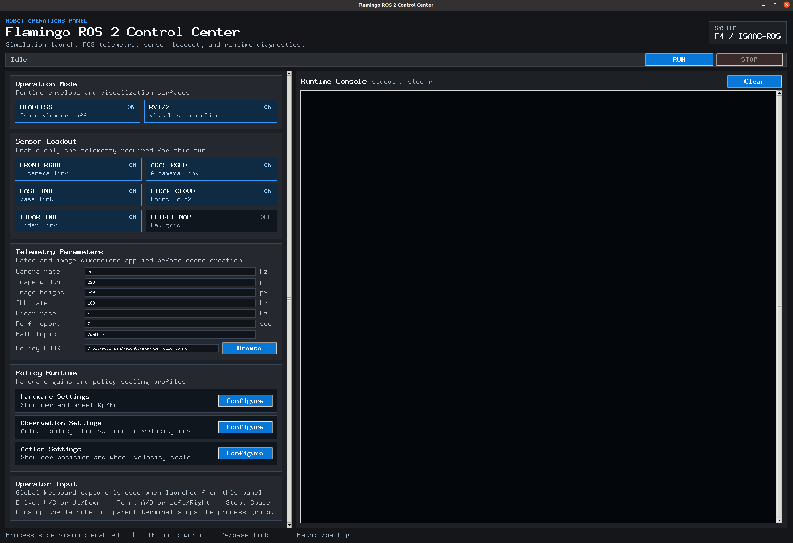
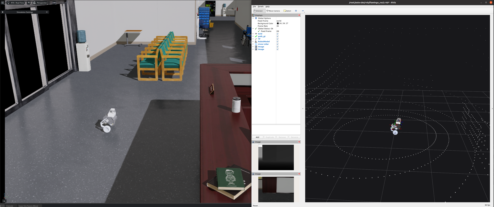
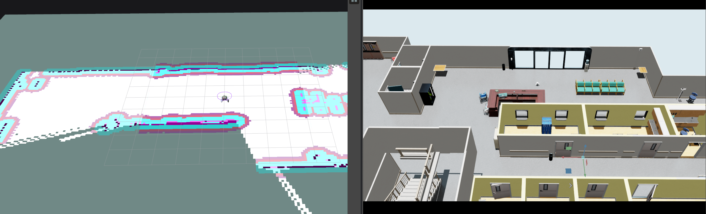

# Flamingo ROS 2 Auto-Sim

[](https://docs.omniverse.nvidia.com/isaacsim/latest/overview.html)
[](https://isaac-sim.github.io/IsaacLab/)
[](https://docs.python.org/3/whatsnew/3.10.html)
[](https://docs.ros.org/en/humble/)
[](https://releases.ubuntu.com/)
[](https://opensource.org/license/mit)

Flamingo ROS 2 Auto-Sim은 Isaac Lab 기반 Flamingo 로봇 시뮬레이션을 실행하고, RViz2로 ROS 2 센서/TF 데이터를 확인하며, ONNX 정책과 키보드 명령으로 로봇을 제어하기 위한 통합 실행 환경입니다.

현재 개발 및 실행 검증 기준 버전은 **Isaac Sim 5.1.0**, **Isaac Lab 2.3.2**입니다.

## 한눈에 보기

### Control Center GUI

`launch.sh`를 실행하면 아래와 같은 Control Center가 열립니다. 이 화면에서 Isaac 실행 모드, RViz2, 카메라/IMU/LiDAR, ONNX 정책, 제어 파라미터를 한 번에 설정할 수 있습니다.



### 실행 예시

왼쪽은 Isaac Sim에서 구동 중인 Flamingo 로봇, 오른쪽은 RViz2에서 확인하는 TF, 경로, LiDAR point cloud, 카메라 토픽 예시입니다.



### SLAM + Nav2 자율주행

왼쪽 RViz2 화면은 주행하면서 확장되는 동적 점유격자 지도와 Nav2 global/local costmap의 장애물 및 inflation 영역을 보여줍니다. 오른쪽 Isaac Sim 화면은 같은 시점의 병원 환경과 로봇 위치입니다. 사용자는 RViz2의 `Nav2 Goal` 도구나 `/navigate_to_pose` action으로 목적지를 지정할 수 있으며, 최종 주행 명령은 `core/msg/CommandUser`로 변환되어 시뮬레이터와 실기 제어기에 동일하게 전달됩니다.



## 빠른 실행

```bash
./launch.sh
```

GUI 없이 바로 실행하려면 다음 스크립트를 사용할 수 있습니다.

```bash
./run_play_ctrl_ros2.sh --headless
```

기본 실행은 다음을 함께 시작합니다.

| 구성 요소 | 역할 |
| --- | --- |
| Isaac Lab / Isaac Sim | Flamingo 로봇과 환경 시뮬레이션 |
| ROS 2 bridge | joint states, TF, camera, IMU, LiDAR, path, command topic 발행 |
| robot_state_publisher | URDF 기반 RobotModel/TF 시각화 지원 |
| RViz2 | ROS 2 토픽과 로봇 상태 시각화 |
| Super-LIO / Nav2 | `map -> odom` 위치 추정, 동적 점유격자 지도와 자율주행 |
| ONNX policy runtime | `weights/example_policy.onnx` 기반 정책 추론 |

## GUI 사용법

### 1. 상단 상태 바

| 항목 | 설명 |
| --- | --- |
| `RUN` | 현재 GUI 설정을 환경 변수와 CLI 인자로 변환해 `run_play_ctrl_ros2.sh`를 실행합니다. |
| `STOP` | 실행 중인 Isaac/ROS/RViz2 프로세스 그룹을 종료합니다. |
| 상태 표시 | `Idle`, `Running PID ...`, `Stopped` 등 현재 실행 상태를 보여줍니다. |

### 2. Operation Mode

| 옵션 | 기본값 | 설명 |
| --- | --- | --- |
| `HEADLESS` | ON | Isaac Sim viewport를 끄고 백그라운드 성능 중심으로 실행합니다. RViz2는 별도로 켤 수 있습니다. |
| `RVIZ2` | ON | `rviz/flamingo_ros2.rviz` 설정으로 RViz2를 실행합니다. ROS 토픽, TF, RobotModel, LiDAR, 카메라를 확인할 때 사용합니다. |

### 3. Sensor Loadout

필요한 센서만 켜서 시뮬레이션 부하를 조절할 수 있습니다.

| 옵션 | 기본값 | ROS 2 출력 |
| --- | --- | --- |
| `FRONT RGBD` | ON | `/f4/front_camera/rgb/image_raw`, `/f4/front_camera/depth/image_rect_raw`, camera info |
| `ADAS RGBD` | ON | `/f4/adas_camera/rgb/image_raw`, `/f4/adas_camera/depth/image_rect_raw`, camera info |
| `BASE IMU` | ON | `/f4/imu` |
| `LIDAR CLOUD` | ON | `/f4/lidar/points` |
| `LIDAR IMU` | ON | `/f4/lidar/imu` |
| `HEIGHT MAP` | OFF | `/f4/height_map/points` |

### 4. Telemetry Parameters

센서 발행 주기와 이미지 크기, 경로 토픽, 정책 파일을 설정합니다. 값은 `RUN`을 누르는 시점에 적용됩니다.

| 항목 | 기본값 | 설명 |
| --- | --- | --- |
| `Camera rate` | `30 Hz` | Front/ADAS RGBD 카메라 publish rate |
| `Image width` | `320 px` | 카메라 이미지 너비 |
| `Image height` | `240 px` | 카메라 이미지 높이 |
| `IMU rate` | `100 Hz` | Base IMU와 LiDAR IMU publish rate |
| `Lidar rate` | `5 Hz` | LiDAR point cloud publish rate |
| `Perf report` | `2 sec` | 콘솔에 real-time factor와 publish rate를 출력하는 주기 |
| `Path topic` | `/path_gt` | ground-truth robot path 발행 토픽 |
| `Policy ONNX` | `weights/example_policy.onnx` | 추론에 사용할 ONNX 정책 파일 |

### 5. Policy Runtime

정책 출력과 관측값 스케일을 실행 전에 조정합니다. 각 `Configure` 버튼을 누르면 세부 값을 편집할 수 있습니다.

| 설정 | 주요 항목 | 설명 |
| --- | --- | --- |
| `Hardware Settings` | Shoulder/Wheel `Kp`, `Kd` | 어깨 관절과 휠 제어기의 PD gain |
| `Observation Settings` | joint pos/vel, base angular velocity, projected gravity, command velocity scale | policy observation에 들어가는 값의 스케일 |
| `Action Settings` | shoulder action, wheel action | policy action을 실제 shoulder position, wheel velocity 명령으로 변환하는 스케일 |

### 6. Operator Input

GUI에서 실행하면 전역 키보드 입력을 사용해 로봇을 조종합니다.

| 키 | 동작 |
| --- | --- |
| `W` / `Up` | 전진 |
| `S` / `Down` | 후진 |
| `A` / `Left` | 좌회전 |
| `D` / `Right` | 우회전 |
| `Space` | 명령 초기화/정지 |

터미널 headless 실행에서는 필요에 따라 `/dev/tty` 기반 stdin teleop fallback을 사용합니다.

### 7. Runtime Console

오른쪽 콘솔에는 실행 명령, 적용된 환경 변수, Isaac/ROS 2 로그, 센서 발행 상태, performance report가 출력됩니다. `Clear` 버튼으로 로그 화면만 비울 수 있으며, 프로세스 실행 상태에는 영향을 주지 않습니다.

## ROS 2 토픽 요약

| 토픽 | 메시지/역할 |
| --- | --- |
| `/f4/joint_states` | RViz2 RobotModel과 TF 계산에 사용되는 joint state |
| `/path_gt` | `world` 기준 ground-truth 경로 |
| `/f4/front_camera/rgb/image_raw` | Front RGB 이미지 |
| `/f4/front_camera/depth/image_rect_raw` | Front depth 이미지 |
| `/f4/adas_camera/rgb/image_raw` | ADAS RGB 이미지 |
| `/f4/adas_camera/depth/image_rect_raw` | ADAS depth 이미지 |
| `/f4/imu` | Base IMU |
| `/f4/lidar/points` | LiDAR PointCloud2 |
| `/f4/lidar/imu` | LiDAR IMU |
| `/lio/cloud_world` | `map` 좌표계로 정합된 SLAM PointCloud2 |
| `/lio/cloud_sensor` | Nav2 clearing용 전체 LiDAR 좌표계 PointCloud2 |
| `/lio/cloud_sensor_obstacles` | scan별 지면 평면을 제거한 Nav2 marking 전용 PointCloud2 |
| `/map` | 관측 범위와 함께 확장되는 `nav_msgs/OccupancyGrid` (`-1` unknown, `0` free, `100` occupied) |
| `/global_costmap/costmap` | `/map` + 실시간 장애물 + inflation을 합성한 Nav2 global costmap |
| `/local_costmap/costmap` | 로봇 주변에서 이동하는 Nav2 local rolling costmap |
| `/navigate_to_pose` | RViz2 Navigation 2 패널과 터미널에서 사용하는 Nav2 goal action |
| `/control_command/user_odom` | Nav2의 최종 smoothed velocity를 변환한 `core/msg/CommandUser`; 시뮬레이터 RL observation과 실기 제어기의 공통 입력 |

기본 주행 TF 구조는 `map -> odom -> f4/slam_imu_link -> f4/base_link`이며, URDF 센서/관절 링크에는 `f4/` prefix가 붙습니다. RViz2의 `Dynamic Occupancy Map (white)`는 관측된 free/occupied 영역을 표시하고, Global/Local Costmap은 그 위에 장애물 비용과 inflation을 겹쳐 표시합니다.

이 구성에서 Super-LIO는 자세와 3D 정합 cloud를 만들고, `live_occupancy_mapper`가 scan별 지면 평면을 제거한 뒤 2D `/map`으로 투영합니다. Nav2 global costmap은 이 누적 `/map`을 StaticLayer로 사용하고, 실시간 cloud는 별도로 장애물 marking과 ray clearing에 사용합니다. 따라서 SLAM map과 PointCloud2 중 하나만 선택하는 구조가 아니라, 누적 지도는 전역 경로 계획에, 현재 센서 관측은 동적 장애물과 clearing에 함께 사용됩니다.

자율주행 제어 경로는 `Nav2 controller -> velocity smoother -> /nav2/cmd_vel -> nav2_command_user_bridge -> /control_command/user_odom`입니다. `/nav2/cmd_vel`은 autonomy 패키지 내부 토픽이며, 시뮬레이터는 이를 직접 구독하지 않습니다. 시뮬레이터와 실기 모두 `core/msg/CommandUser`의 twist를 동일하게 소비하고, 시뮬레이터에서는 이 값이 locomotion command term과 강화학습 policy observation에 함께 반영됩니다.

## 설치

이 저장소는 Ubuntu + Isaac Sim 5.1.0 + Isaac Lab 2.3.2 환경에서 개발 및 실행 검증되었습니다.

### 1. Isaac Sim 설치

Isaac Lab 공식 문서의 binary/local installation 절차를 따릅니다.

```text
https://isaac-sim.github.io/IsaacLab/main/source/setup/installation/binaries_installation.html
```

### 2. Isaac Lab 설치

```text
https://github.com/isaac-sim/IsaacLab
```

기본 스크립트는 다음 경로를 가정합니다. 다른 위치를 사용한다면 환경 변수로 덮어쓸 수 있습니다.

```bash
export ISAACLAB_ROOT=/root/IsaacLab
export CONDA_SH=/root/miniconda3/etc/profile.d/conda.sh
export CONDA_ENV=env_isaaclab
```

### 3. 패키지 설치

저장소 루트에서 editable install을 수행합니다.

```bash
conda activate env_isaaclab
pip install -e .
```

### 4. ROS 2 환경

기본값은 ROS 2 Humble입니다.

```bash
export ROS_DISTRO=humble
export ROS_SETUP=/opt/ros/humble/setup.bash
export ROS_WS_SETUP=/root/ros2_ws/install/setup.bash
```

`core/msg/CommandUser`, `core/msg/EventUser`의 원본 스키마는
`cocelo-hd-slam-yaw/interfaces/core`에 포함되어 있습니다.
`run_play_ctrl_ros2.sh`는 Isaac의 Python ABI에 맞춰 이 패키지를
`core_ws`에 자동 빌드하므로 별도 인터페이스 저장소가 필요하지 않습니다.

## 스크립트 구조

| 파일/폴더 | 설명 |
| --- | --- |
| `launch.sh` | Tkinter 기반 Flamingo ROS 2 Control Center GUI |
| `run_play_ctrl_ros2.sh` | Conda/Isaac/ROS 환경 설정, RViz2/robot_state_publisher 실행, `play_ctrl.py` 호출 |
| `scripts/co_rl/play_ctrl.py` | Isaac Lab 환경 실행, ONNX policy inference, teleop, ROS 2 sensor publisher 생성 |
| `scripts/co_rl/ros2.py` | ROS 2 camera, IMU, LiDAR, TF, path, command bridge 구현 |
| `rviz/flamingo_ros2.rviz` | RViz2 기본 시각화 설정 |
| `urdf/` | RViz2 RobotModel용 URDF와 mesh |
| `weights/example_policy.onnx` | 기본 예제 정책 |
| `resource/gui.png` | README용 GUI 스크린샷 |
| `resource/example.png` | README용 Isaac/RViz2 실행 예시 |
| `resource/nav2_image.png` | SLAM 동적 지도, Nav2 costmap과 Isaac Sim 자율주행 예시 |

## CLI 실행 예시

GUI에서 설정하는 값은 대부분 환경 변수로도 제어할 수 있습니다.

```bash
RUN_RVIZ2=1 \
ENABLE_ROS2_FRONT_CAMERA=1 \
ENABLE_ROS2_ADAS_CAMERA=1 \
ENABLE_ROS2_IMU=1 \
ENABLE_ROS2_LIDAR=1 \
POLICY_ONNX_PATH="$PWD/weights/example_policy.onnx" \
./run_play_ctrl_ros2.sh --headless
```

Performance report 주기를 바꾸려면 추가 인자를 전달합니다.

```bash
./run_play_ctrl_ros2.sh --headless --perf_report_interval 1
```

## 문제 해결

| 증상 | 확인할 것 |
| --- | --- |
| `tkinter is not available` | GUI 대신 `run_play_ctrl_ros2.sh --headless`로 fallback됩니다. GUI가 필요하면 OS Python tkinter 패키지를 설치하세요. |
| RViz2가 뜨지 않음 | `RUN_RVIZ2=1`, `rviz2` 명령 설치 여부, `rviz/flamingo_ros2.rviz` 경로를 확인하세요. |
| ONNX 파일 오류 | GUI의 `Policy ONNX` 경로나 `POLICY_ONNX_PATH`가 실제 `.onnx` 파일을 가리키는지 확인하세요. |
| ROS 메시지 import 실패 | `ROS_WS_SETUP`, `ROS_PYTHON`, `colcon` 설치 여부를 확인하세요. 스크립트는 기본적으로 `core` 메시지를 자동 빌드합니다. |
| 센서가 너무 느림 | Camera resolution/rate, LiDAR rate, HEIGHT MAP 옵션을 낮추거나 끄세요. |

## License

MIT License. 자세한 내용은 [LICENCE](LICENCE)를 참고하세요.
